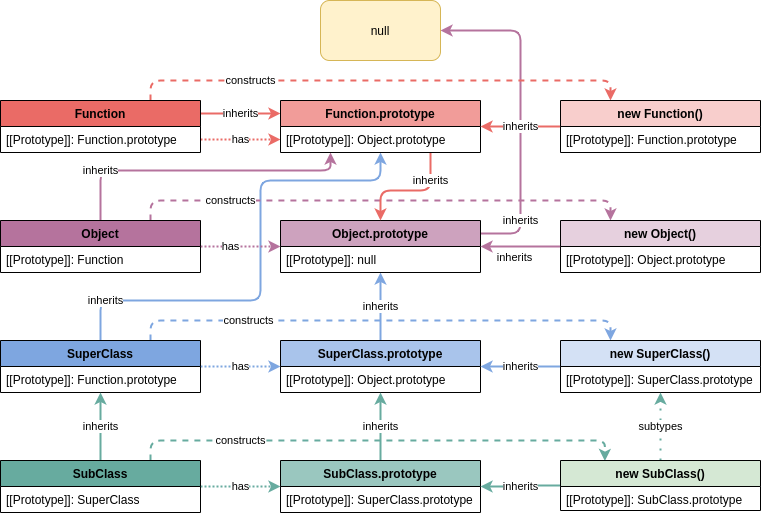
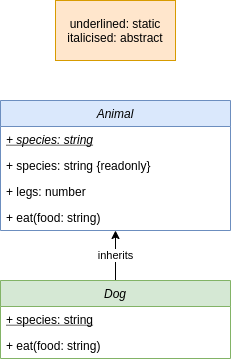
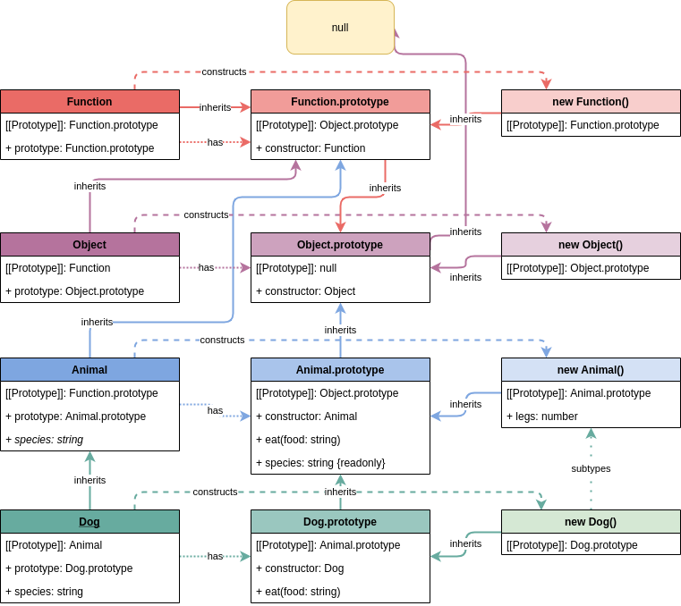

# JavaScript Inheritance: the Dark Arts

Inheritance remains one of the most relied upon and misunderstood features of JavaScript to this day. Since ES2015 JavaScript developers have been able to ignore how the inheritance sausage is made by relying on the `class` syntax that hides the nitty gritty details, until they run into its mind-bending edge cases.

In this post we'll explore the secrets of JavaScript inheritance: `[[Prototype]]`, constructors and how to better understand your javascript objects.

But first, put your knowledge to the test:

## How many can you get right?

### 1. Overriding getters and setters

```javascript
console.log('Overriding getters and setters');

class SuperClass {
  _value = undefined;
  get value() { return this._value; }
}
class SubClass extends SuperClass {
  set value(to) { this._value = to; }
}
const sub = new SubClass();
sub.value = 5;

// What gets logged?

console.log(sub.value); // undefined
```

### 2. Deleting from a class instance

```javascript
console.log('Deleting from a class instance');

class MyClass {
  fn1 = function() {}
  fn2() {}
}
const myInstance = new MyClass();

// What gets logged?

delete myInstance.fn1;
console.log(myInstance.fn1); // undefined

delete myInstance.fn2;
console.log(myInstance.fn2); // fn2() {}
```

### 3. Deleting from an object

```javascript
console.log('Deleting from an object');

const myObject = {
  fn() {},
  toString() {},
};

// What gets logged?

delete myObject.fn;
console.log(myObject.fn); // undefined

console.log(myObject.toString); // toString() {}
myObject.toString = undefined
console.log(myObject.toString); // undefined
delete myObject.toString;
console.log(myObject.toString); // toString() { [native code] }
```

### 4. Overriding constructors???

```javascript
class MyClass {
  constructor() {
    console.log("Original Consturctor");
  }
}

MyClass.prototype.constructor = function Overridden() {
  console.log("Overridden Constructor");
}

// What gets logged?

const instance = new MyClass(); // "Original Constructor"
console.log(instance.constructor.name);  // Overridden
console.log(instance.constructor.prototype === Object.getPrototypeOf(instance)); // false
```

If you got all of the above right then maybe you're already grizzled JavaScript veteran and know all the ins and outs of OOJS (Object Oriented JavaScript).

For the rest of us, it's time to open Pandora's Box.

## Inheritance

In OOP (Object Oriented Programming), inheritance is the mechanism used build a new object or class ontop another object or class.

JavaScript has inheritance but doesn't have static "classes" like static OO languages (C++, C#, Java). Instead, JavaScript links objects together by [prototypes](https://en.wikipedia.org/wiki/Prototype-based_programming). Even in ES2015, [`class`](https://developer.mozilla.org/en-US/docs/Web/JavaScript/Reference/Classes) is mostly just syntactic sugar for objects with prototypal relationships.

At a glance, OOJS using `class` appears sane.

```javascript
class Base {
  prop = 'hello world';
}
class Sub extends Base {
  //
}
const sub = new Sub();
// sub has access to properties on base
console.log(sub.prop);  // "hello world"
```

But how does this really work? What is a "class" and how does `sub` have access to `prop`?

## Enter: [[Prototype]]

JavaScript uses `prototypes` to achieve inheritance. All objects have a `[[Prototype]]` [internal slot](https://tc39.es/ecma262/#sec-ordinary-object-internal-methods-and-internal-slots) which is the object being inherited from. Internal slots are internal to the JavaScript interpreter. Some internal slots are exposed via functions like `Object.getPrototypeOf()` and many aren't exposed at all.

An object's `[[Prototype]]` can be null or another object which itself has a `[[Prototye]]` slot. An object's linked list of `[[Prototype]]`s (i.e. `myObject.[[Prototype]].[[Prototype]].[[Prototype]]...`) is called its "prototype chain" and terminates with null.

To lookup a property on an object the JavaScript interpreter performs a lookup on the top-level object, then that object's `[[Prototype]]`, then `[[Prototype]].[[Prototype]]`, and so on until reaching `null`.

We can use [`Object.create(proto)`](https://developer.mozilla.org/en-US/docs/Web/JavaScript/Reference/Global_Objects/Object/create) to create a new object with `proto` as its `[[Prototype]]` and use [`Object.getPrototypeOf(obj)`](https://developer.mozilla.org/en-US/docs/Web/JavaScript/Reference/Global_Objects/Object/getPrototypeOf) to get the `[[Prototype]]` of an object `obj`

```javascript
const ancestor = Object.create(null);
const parent = Object.create(ancestor);
const child = Object.create(parent);

// child inherits from parent
console.log(Object.getPrototypeOf(child) === parent); // true
// parent inherits from ancestor
console.log(Object.getPrototypeOf(parent) === ancestor); // true
// ancestor inherits nothing
console.log(Object.getPrototypeOf(ancestor) === null); // true
```

We can also use [`Object.setPrototypeOf(sub, base)`](https://developer.mozilla.org/en-US/docs/Web/JavaScript/Reference/Global_Objects/Object/setPrototypeOf) to change the `[[Prototype]]` of an object `sub` to another object (or `null`), `base`. Notice - unlike static OO languages we can dynamically change inheritance heirarchies at runtime! For performance reasons this is *strongly* advised against. According to Benedikt Muerer of v8, [a every time you change the prototype chain, a kitten dies](https://youtu.be/IFWulQnM5E0?t=1669).

```javascript
const base = { prop: 'hello world' };
const sub = {};
console.log(sub.prop); // undefined
Object.setPrototypeOf(sub, base);
console.log(sub.prop); // "hello world"
Object.setPrototypeOf(sub, null);
console.log(sub.prop); // undefined
```

Objects created using the object literal syntax `{}` inherit from JavaScript's base `Object.prototype` which in-turn inherits from `null`.

```js
const obj = {};
console.log(Object.getPrototypeOf(obj) === Object.prototype); // true
console.log(Object.getPrototypeOf(Object.prototype) === null); // true
```

## Functions

Functions are a regular JavaScript objects, but with additional [internal slots](https://tc39.es/ecma262/#sec-ecmascript-function-objects). Like regular objects they have properties and a `[[Prototype]]` internal slot, but unlike other objects they are callable thanks to a [`[[Call]]` internal method](https://tc39.es/ecma262/#sec-ecmascript-function-objects-call-thisargument-argumentslist).

Constructors are functions with some specific attributes.

## Enter: Constructors

Constructor functions compliment prototypes by making prototype configuration and object creation and inialisation easy and consistent. Inheritance can still be achieved without constructors (for example with `Object.create`) but it's less common.

Any non-arrow function (any function created with the `function` keyword) can be used as a constructor. All non-arrow functions have a `prototype` property, initialized to a new object with only one property `prototype.constructor` whose value is the constructor function. Note that a function's `prototype` property is NOT the same as that functions `[[Prototype]]` internal slot.

Constructors have to be called with a the `new` operator (unless being used within another constructor function for inheritance) for the `this` variable to be created and bound correctly. The `this` object's `[[Prototype]]` is set to the constructors `prototype` property.

It's good practice to begin constructor names with an uppercase character so you know to call them with `new`.

```javascript
function Constructor() {} 
console.log(Constructor.prototype); // { constructor: f }
const instance = new Constructor();
console.log(Object.getPrototypeOf(instance) === Constructor.prototype) // true
// i.e. instance.[[Prototype]] === Constructor.prototype
```

When called with `new`, construtors implicitly return their `this` object.

```javascript
let this_ref;

function Constructor() {
  console.log(Object.getPrototypeOf(this) === Constructor.prototype); // true
  this_ref = this;
  // implicitly returns `this`
}

const that = new Constructor();
console.log(that === this_ref); // true;
```

"classes" created with the ES2015 (e.g. `class MyClass {...}`) are also simply constructor functions (`typeof MyClass === 'function'`) but whose internal slots are configured differently, such as [`[[IsClassConstructor]]`](https://tc39.es/ecma262/#sec-ecmascript-function-objects) that [causes classes to throw](https://tc39.es/ecma262/#sec-ecmascript-function-objects-call-thisargument-argumentslist) a `TypeError` if called without the `new` operator, unlike constructor functions not created with the `class` syntax.

Given that instances created with the `new` operator inherit from their constructors `prototype` property, we can create functions on the `prototype` property that will be inherited by the instances.

```javascript
function Person() {
  //
}

Person.prototype.sayHello = function() {
  console.log('hello');
}

const person = new Person();
person.sayHello();  // 'hello'
```

## ES2015 classes without ES2015 syntax

Now that we know about prototypes and constructors we can replicate the ES2015 class functionality with constructor functions and prototypes.

Using constructor-prototype syntax we have enormous flexibility in how we glue together our objects at the price of having to glue them together manually.

We can manually accomplish what the ES2015 `class` syntax does for us by maintaining the following:

- **Instance prototype chain**: `SubClass.prototype.[[Prototype]]` must be set to `SuperClass.prototype`. This sets up the prototype chain of instances constructed from `new SubClass(...)` such that:
  - `subclass_instance.[[Prototype]]` === SubClass.prototype
  - `subclass_instance.[[Prototype]][[Prototype]]` === SuperClass.prototype
  - `subclass_instance.[[Prototype]][[Prototype]][[Prototype]]` === Object.prototype
  - `subclass_instance.[[Prototype]][[Prototype]][[Prototype]][[Prototype]]` === null
- **Constructor prototype chain**: `SubClass.[[Prototype]]` must be set to `SuperClass`. This means the `SubClass` function inherits "static" properties from `SuperClass` (properties on the SuperClass constructor function) such that:
  - `SuperClass.staticProperty = 5`
  - `SubClass.staticProperty === 5`
- **Initialisation**: When the `SubClass` constructor is called with `new`, it needs to immediately call the `SuperClass` constructor function binding its `this` value (`SuperClass.call(this, ...)`), in order to initialise `SuperClass` on `this` properly.
  - The ES2015 `class` syntax forces us to call the super constructor using `super()` at the beginning of our subclasses constructor function, or else the interpreter will throw an error. This is not forced in constructor-prototype syntax so we need to remember it ourselves! Otherwise our class instances will not be properly initialised.

Our object relations for the model described above are:



Don't be intimidated by the number of objects and connections - if you can grok the diagram then you can derive an understanding of everything relating OOJS.

## The `super` Problem

The only `class` functionality we can't *exactly* replicate with constructors and prototypes is `super`.

```javascript
function Base() {}
Base.prototype.fn = function() {
  console.log('base');
}

function AnotherBase() {}
AnotherBase.prototype.fn = function() {
  console.log('another base');
}

function Sub() {}
Object.setPrototypeOf(Sub, Base);
Sub.prototype.fn = function() {
  console.log('sub');
  // !!!!!!!!!!!!!!!!!!!!!!!!!!!!!!!!!
  // "super" call, hardcoded to `Base`
  // !!!!!!!!!!!!!!!!!!!!!!!!!!!!!!!!!
  Base.prototype.fn.call(this);
}

const sub = new Sub();

sub.fn();
// sub
// base

Object.setPrototypeOf(Sub, AnotherBase);
Object.setPrototypeOf(Sub.prototype, AnotherBase.prototype);
sub.fn();
// sub
// base
```

Without referencing the superclass, `Base`, directly we have no way to determine where the current method under invocation sits in the prototype chain, and therefore can't lookup functions that are strictly higher in the prototype chain (i.e. a `super` call).

By referencing `Base` directly in an attempt to replicate `super`, we've destroyed our ability to safely change the prototype since our "super" call would be referencing a function we no longer inherit.

With ES2015, we have a `super` keyword that still works when we reassign `[[Prototype]]`

```javascript
class Base {
  fn() {
    console.log('base');
  }
}

class AnotherBase {
  fn() {
    console.log('another base');
  }
}

class Sub extends Base {
  fn() {
    console.log('sub');
    super.fn();
  }
}

const sub = new Sub();

sub.fn();
// sup
// base

Object.setPrototypeOf(Sub, AnotherBase);
Object.setPrototypeOf(Sub.prototype, AnotherBase.prototype);

sub.fn();
// sup
// another base
```

## Pre ES2015 classes by example

We'll code a simple inheritance example of 2 classes: a superclass `Animal` and subclass `Dog` using the relations described above. Each inheritance layer has 3 associated objects: the constructor function, prototype object and instance object.

Our domain is:



In JavaScript, our objects will be:



```javascript
/**
 * @constructor Animal
 * @abstract
 *
 * @param {number} legs
 */
function Animal(legs) {
  this.legs = legs;
}

/**
 * Abstract static property on Animal constructor
 * to be overridden by a property the subclasses constructor
 *
 * @abstract
 * @static
 * @type {string}
 */
Animal.species = undefined;

/**
 * getter on the animal prototype that retrieves the static, overridden
 * property from the subclasses constructor, `species`
 * 
 * @readonly
 * @type {string}
 * 
 * @example
 * const dog = new Dog()
 * dog.species; // calls `Animal.prototype.species` -> `Dog.species`
 */
Object.defineProperty(Animal.prototype, 'species', {
  enumerable: true,
  configurable: false,
  /** @returns {string} */
  get() {
    // alternatively, `const SubClass = this.constructor`
    const SubClass = Object.getPrototypeOf(this).constructor;
    return SubClass.species;
  },
})

/**
 * Method on the Animal prototype, inherited by animal instances and subclasses
 * of Animal
 *
 * @param {string} food
 */
Animal.prototype.eat = function(food) {
  console.log(`Yum! eating ${food}`);
}


/**
 * @constructor Dog
 *
 * Subclass of Animal
 */
function Dog() {
  const legs = 4;

  // we run the inherited constructor, bound to `this`, to initialise our superclass properly
  // this effectively "subtypes" `this` to an instance of the superclass (`this` becomes a superset of the superclasses instances type)

  Animal.call(this, legs);
}

// Inherit staticically from Animal
Object.setPrototypeOf(Dog, Animal);

// Inherit prototype from Animal
Object.setPrototypeOf(Dog.prototype, Animal.prototype);

/**
 * @override
 * @type {string}
 */
Dog.species = 'Dog';

/**
 * Override the `eat` method from `Animal.prototype`
 * Also call the super method
 *
 * @override
 *
 * @param {*} food
 */
Dog.prototype.eat = function(food) {
  console.log('Woof!');

  // super call!
  Animal.prototype.eat.call(this, food);
}

const dog = new Dog();

dog.eat('chicken');
// 'Woof!'
// 'Yum! eating chicken'

console.log(dog.species);
// 'Dog'
```

## Access to inherited properties

One of the most important things to understand when working directly with prototypes is how accessors and operators propagate. Of the following actions, only the `get` accessor propagates up the prototype chain.

| accessor or operator | propagates up the prototype chain |
| --- | --- |
| get | yes |
| set | no |
| delete | no |

```javascript
const base = { prop: 'hello', ref: {} };
const sub = {};
Object.setPrototypeOf(sub, base);
console.log(sub.prop); // 'hello'

// the `delete` operator does not propagate

// calling delete on `prop` can have no effect on objects in its prototype chain
delete sub.prop;
console.log(sub.prop); // 'hello'

// similarly, the `set` accessor does not propagate
console.log(sub.ref === base.ref); // true
base.ref = { a: 'different', object: true };
console.log(sub.ref === base.ref); // true
sub.ref = { something: 'else' };
console.log(sub.ref === base.ref); // false
```

## Who cares?

Most JavaScript application developers don't need to know its inheritance mechanism in great detail. Some of JavaScript's most flexible features, including prototype hacking, are considered footgun's to be avoided. If you feel the need to hack a prototype chain you're probably better off finding another way.

Knowing about prototypes is more important when working in the broader ecosystem with packages or tooling or when monkeypatching libraries (modifying prototypes of objects from third party libraries).

## How does TypeScript fit into this?

Unfortunately, like a square peg into a round hole.

TypeScript doesn't attempt to model the fine details of OOJS. It doesn't differentiate between properties on a class instance and properties on a classes prototype.

```typescript
class MyClass {
  instanceProperty: number;
  prototypeProperty() {};
  constructor() { this.instanceProperty = 5; }
}

// TypeScript sees instances of MyClass as equivalent to:
interface MyClassInstance {
  instanceProperty: number;
  prototypeProperty() {};
}
// properties of the prototype and instance are merged together
```

Moreover, TypeScript doesn't even allow adding `new` signature to a constructor function.

```typescript
const MyConstructor: { new(): {} } = function() {}
// Type '() => void' is not assignable to type 'new () => {}'.
```

To use TypeScript on constructor functions have to resort to the unsafe `as unknown` hack. The language server also won't tell us when our prototype is missing properties

```typescript
interface MyInstanceAndPrototype {
  //
  methodOnPrototype() {};
}

interface MyConstructor extends Function {
  new(): MyInstanceAndPrototype;
  prototype: MyInstanceAndPrototype;
}

const MyConstructor = function MyConstructor() {} as unknown as MyConstructor

// Forgot to add `MyConstructor.prototype.methodOnPrototype`?
// There won't be any TypeScript error
```

## Revisiting our examples

With our understanding of prototypes, constructors and property access, we can revisit our and understand initial examples

### Explanation: 1. Overriding getters and setters

```javascript
console.log('Overriding getters and setters');

class SuperClass {
  _value = undefined;
  get value() { return this._value; }
}
class SubClass extends SuperClass {
  set value(to) { this._value = to; }
}
const sub = new SubClass();
sub.value = 5;

// What gets logged?

console.log(sub.value); // undefined
```

What went wrong?

Writing this in pre-ES2015 syntax we have something close to:

```javascript
console.log('Overriding getters and setters');

function SuperClass() {
  this._value = undefined;
}
Object.defineProperty(SuperClass.prototype, 'value', {
  get() { return this._value },
})

function SubClass() {}

Object.setPrototypeOf(SubClass, SuperClass);
Object.setPrototypeOf(SubClass.prototype, SuperClass.prototype);

Object.defineProperty(SubClass.prototype, 'value', {
  set(to) { this._value = to; },
});

const sub = new SubClass();

sub.value = 5;

// What gets logged?

console.log(sub.value); // undefined
```

Notice we have both `SubClass.prototype.value` and `SuperClass.prototype.vaue`.
`SubClass.prototype.value` overrides `SuperClass.prototype.value`. `SubClass.prototype.value` has a setter with NO GETTER!! When we read `sub.value`, we accessing `SubClass.prototype.value` which has no getter and a value of undefined by default, and therefore returns `undefined`. We never reach `SuperClass.prototype.value`! This issue once cost me 4 hours in debugging hell.

### Explanation: 2. Deleting from a class instance

```javascript
console.log('Deleting from a class instance');

class MyClass {
  fn1 = function() {}
  fn2() {}
}
const myInstance = new MyClass();

// What gets logged?

delete myInstance.fn1;
console.log(myInstance.fn1); // undefined

delete myInstance.fn2;
console.log(myInstance.fn2); // fn2() {}
```

Writing this in pre-ES2015 syntax we have something close to:

```javascript
console.log('Deleting from a class instance');

function MyClass() {
  this.fn1 = function() {};
}
MyClass.prototype.fn2 = function fn2() {}

const myInstance = new MyClass();

// What gets logged?

delete myInstance.fn1;
console.log(myInstance.fn1); // undefined

delete myInstance.fn2;
console.log(myInstance.fn2); // fn2() {}
```

Notice that with `class` syntax, setting `property = ...` within the class body is roughly equivalent setting `this.property = ...` within the classes constructor. It places the property on the class instances.

Conversely, `fn2() {}` within the class body adds that function to the classes prototype `MyClass.prototype`.

The delete operator does not propagate up the prototype chain. Therefore we delete `fn1` since its on the class instance, but not `fn2` since it's on the class prototype.

### Explanation: 3. Deleting from an object

```javascript
console.log('Deleting from an object');

const myObject = {
  fn() {},
  toString() {},
};

// What gets logged?

delete myObject.fn;
console.log(myObject.fn); // undefined

console.log(myObject.toString); // toString() {}
myObject.toString = undefined
console.log(myObject.toString); // undefined
delete myObject.toString;
console.log(myObject.toString); // toString() { [native code] }
```

Similar to 2., but now we have an object instance `myObject` with two functions. All objects created with the literal syntax `{}` have their `[[Prototype]]` equal to `Object.prototype`. `Object.prototype` has a `toString` method.

In our example:

- we override `Object.prototype.toString` in the assignment of `myObject`.
  - logging `myObject.toString` prints our overridden copy, `toString() {}`
- we set `myObject.toString = undefined`, which continues to override `Object.prototype.toString` but now with a value of undefined.
  - logging `myObject.toString` prints our overridden copy, `undefined`
- we delete `toString` from `myObject`. now `toString` calls will propagate up the prototype chain.
  - logging `myObject.toString` prints `Object.prototype.toString`.

### Explanation: 4. Overriding constructors???

```javascript
class MyClass {
  constructor() {
    console.log("Original Consturctor");
  }
}

MyClass.prototype.constructor = function Overridden() {
  console.log("Overridden Constructor");
}

// What gets logged?

const instance = new MyClass(); // "Original Constructor"
console.log(instance.constructor.name);  // "Overridden Constructor"
console.log(instance.constructor.prototype === Object.getPrototypeOf(instance)); // "false"
```

This example is bogus. A special place in hell is reserved for people who reassign `Constructor.prototype.constructor`.

- Constructors have a `prototype` property which becomes their instances `[[Prototype]]` internal slot.
- The `prototype` initially has a single property, `constructor`, which points back to the original constructor function.
- The `Constructor.prototype.constructor` is useful to superclasses to create new instances of `this`'s class.

For example, here's a `Container` class that is safe to extend and still call `clone()` on:

```javascript
function Container(items) {
  this.items = items;
}
Container.prototype.clone = function() {
  // we rely on prototype.constructor not being overridden
  return new (Object.getPrototypeOf(this).constructor)([...this.items]);
}

function UserContainer(users) {
  Container.call(this, users);
}
Object.setPrototypeOf(UserContainer, Container);
Object.setPrototypeOf(UserContainer.prototype, Container.prototype);
UserContainer.prototype.logoutAll = function() { /** ... */ }

const users = new UserContainer([]);
const users2 = users.clone();
console.log(users2 instanceof UserContainer); // true
```

As far as I'm aware there's no good reason to ever change `prototype.constructor`, other than as a good April Fools joke.

## Further Reading

- Older libraries like `express` still use prototypes and constructors. Check out [Express.Request](https://github.com/expressjs/express/blob/master/lib/request.js) for an example. [Express uses Object.create()](https://github.com/expressjs/express/blob/master/lib/express.js#L46) to use blueprint objects, `req` and `res`, as the `[[Prototype]]`s for the `req` and `res` of a request instance.
